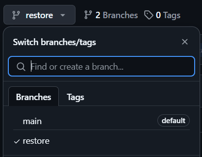

------------------------------------------------------------------------------------------------------
PROCESSUS DE RESTAURATION GITHUB
------------------------------------------------------------------------------------------------------
Suite à une modification de code dans GitHub, votre solution ne fonctionne plus. Vous devez donc restaurer votre code mais comment faire.  

**Exercice :** Ecrire dans ce Readme une procédure pour expliquer étape par étape le processus de restauration d'un code issue de votre historique (vos commits). C'est dire, décivrez comment faire un Checkout depuis l'interfaçe GitHub. Vous trouverez ci-dessous le début de la séquence de restauration.  

-------------------------------------------------------------------------------------------------------
Début de procédure : Historique des commits
-------------------------------------------------------------------------------------------------------
L'historique de vos commits vous donne accès à vos différentes versions de votre code.  
A chaque commit, un point de sauvegarde est créé dans GitHub.  

Cliquez sur Commits pour accèder à votre historique de commits  
  
   

Sélectionnez le sauvegarde que vous souhaitez restaurer.  

   

A présent vous n'êtes plus dans votre branche main (branche principale) mais vous naviguez dans un point de restauration (votre code du passé).  

   

Maintenant, il faut créer une nouvelle branche et valider la création de celle-ci. 

Ensuite, vous devez fusionner la nouvelle branche avec celle déjà existante.
Dans "Pull Requests", sélectionner la branche que vous venez de créer comme source, et la précédente comme destination.
Puis, cliquer sur "Merge Pull Request", puis confirmer la fusion. 
